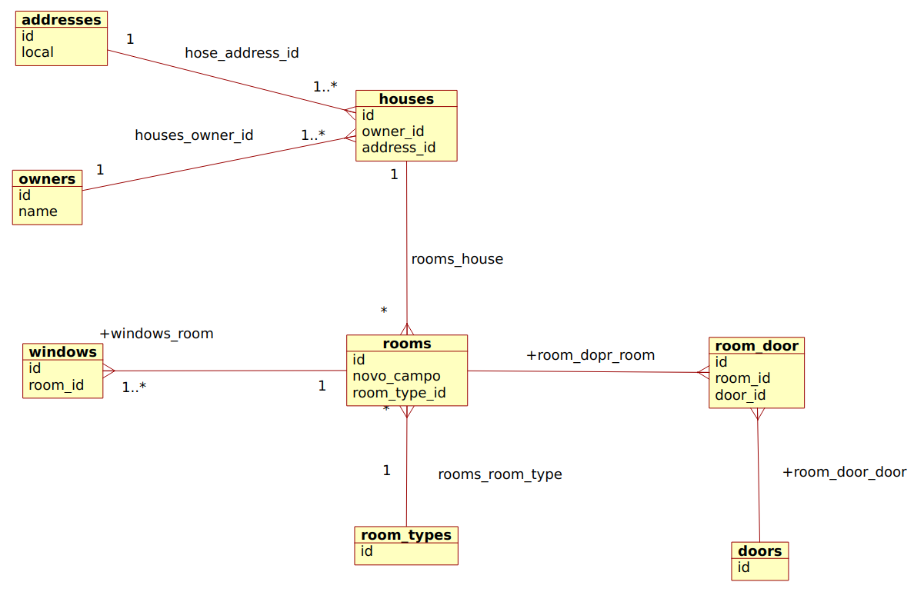

# Laravel Backend - Training

### Objetivos do treinamento

1. Introduzir o uso de testes unitários;
2. Revisar, praticar e aprimorar o uso do ORM Eloquent;
3. Demostrar a praticidade e praticar do uso de testes e de serviços na implementação de regras de negócio.

## O Modelo - visão estrutural do modelo

Tudo que é implementado, parte de um modelo!

**1. O banco de dados - MER**

**2. As classes de modelo - Diagrama de classes**

## Os Testes

### Motivação dos testes ou "porque usar?"

O entendimento fundamental que devemos atingir sobre os testes é que são feitos sobre requisitos, ou seja, o que e como o sistema deve fazer algo.

**Motivos:**

1. Orientar a implementação de regras de negócio e reduzir desperdício;
2. Construir um entendimento mais claro sobre a implementação a ser realizada - apoio à fatoração de código;
3. Definir e Validar requisitos implementados.

### Sobre os requisitos

A disciplina de requisitos no processo de desenvolvimento de software, busca apontar o como estabelecer e gerenciar o uso de requisitos e aplicação dentro deste processo.

Como disciplina, cada metodologia e/ou framework de desenvolvolvimento possui representações textuais para estabelecer os requisitos (i.e.: o scrum possui os Epics e Stories, por exemplo).

Materialmente, **requisitos** nada mais são do que uma descrição genérica ou apontamento a ser traduzido para um sistema;

Após o estabelcimento de um requisito, poderíamos ananlisá-lo e escrever os **Casos de Uso** relacioados, por exemplo, mas não vamos, porque o objetivo geral é estudar a ferramenta, ou seja o Laravel.

### Contexto - O Sistema, visão geral

O sistema deve gerenciar um cadastro de casas com seus proprietários.

### Os requisitos, ou seja, os apontamentos

1. O sistema deve possuir um cadastro de casas e suas configurações (cômodos, portas, janelas, endereço e proprietário);
2. Uma casa deve pussuir um propritário e endereço;
3. Um cômodo deve possuir pelo menos uma porta;
4. O sistema deve listar as casas de um proprietário;
5. O sistema deve informar a quantidade de cômodos, de portas e de janelas de uma casa;

### Regras de negócio e Serviços

As regras de negócio são diretamente deteminadas pelos requisitos, só se implementa uma regra de negócio que é referenciada num requisito.

Isso evita o desperdício de tempo por implementar funcionalidades desnecessárias e apoia uma codificação mais limpa e direta.

Um outro ponto a se observar é que, ao usarmos serviços adequadamente, implementamos um código mais fatorado, testável, manutenível e reusável.

Assumiremos, aqui, que um Seviço representa a implementação de uma regra de negócio ou parte dela, na camada de modelo.

### Os Testes

Os testes devem ser implementados antes de se implementar qualquer outro código, a partir dos requisitos.

Nesse treinamento, por motivos práticos, já foi estabelecida a modelagem conceitual - e a partir desta -  foram implementdas as classes e estruturas do modelo.

#### Comandos para execução de testes

- Laravel - <a href="https://laravel.com/docs/8.x/testing">ver documentação de referência</a>

<pre>php artisan test </pre>

- PHPUnit

<pre>vendor/bin/phpunit --testdox --group=<b>[NOME DO GUPO DE TESTES]</b></pre>

## Exercício

Realize os seguintes testes e implementações (esses exercíos, aqui, "equivalem" aos **Casos de Uso**):

1. Criar uma nova casa;
2. Listar casas por proprietário, com os endereços destas;
3. Listar os cômodos de uma casa, com suas janelas e portas;