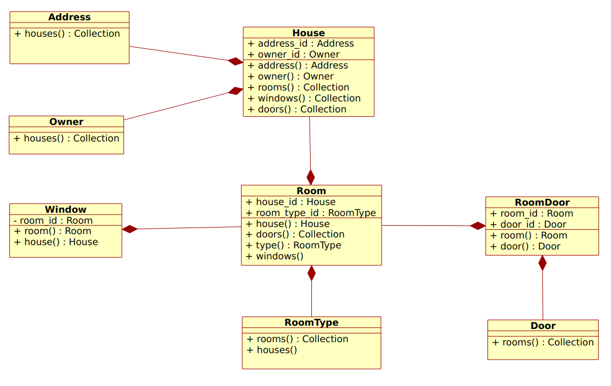

# Laravel Backend - Training

## O Modelo - visão estrutural do modelo

Tudo que é implementado, parte de um modelo!

1. O banco de dados - MER

2. As classes de modelo - Diagrama de classes

## Os Testes

### Motivação dos testes

O entendimento fundamental que devemos atingir sobre os testes é que são feitos sobre requisitos, ou seja, o que e como o sistema deve fazer algo;

### Sobre os requisitos

A disciplina de requisitos no processo de desenvolvimento de software, busca apontar o como estabelecer e gerenciar o uso de reuisitos e aplicação dentro deste processo.

Como disciplina, cada metodologia e/ou framework de desenvolvolvimento possui representações textuais para estabelecer os requisitos (i.e.: o scrum possui os Epics e Stories, por exemplo).

Materialmente, Requisitos nada mais são do que uma descrição genérica ou apontamento a ser traduzido para um algorítmo;

Após o estabelcimento de um requisito, poderíamos ananlisá-lo e escrever os **Casos de Uso** relacioados, por exemplo, mas não vamos, porque o objetivo é estudar a ferramenta, ou seja o Laravel.

Evitando as descrições formais e formatadoas, neste treinamento, apenas será apontado o que deve ser desenvolvido, como meio de orientar o andamento e não sobrecarregar o conteúdo.

### Contexto - O Sistema

O sistema deve gerenciar um cadastro de casas com seus proprietários.

### Os requisitos, ou seja, os apontamentos

1. O sistema deve possuir um cadastro de casas e suas confiurações (cômodos, portas, janelas, endereço e proprietário);
2. Uma casa deve pussuir um propritário e endereço;
3. Um cômodo deve possuir pelo menos uma porta; 
4. O sistema deve listar as casas de um proprietário;
5. O sistema deve informar a quantidade de cômodos, de portas e de janelas de uma casa;

### Os Testes

Os testes são criados antes de se implementar qualquer código, uma vez que eles definem, a aprtir dos requisitos, o que deve ser implementado em termos de funcionalidade.

Nesse treinamento, por motivos didáticos e porque a modelagem conceitual já foi estabelecida, algumas classes já foram implementadas. 

#### Exercício

Relize os seguintes testes:

1. Criar nova casa;
2. Listar casas por proprietário, com os endereços destas;
3. Listar os cômodos de uma casa, com suas janelas e portas;

#### Regras de negócio e Serviços

As regras de negócio são diretamente deteminadas pelos requisitos, só se implementa uma regra de negócio que é reerenciada num requisito.

Isso evita o desperdício de tempo por implementar funcionalidades desnecessárias e apoia uma codificação mais limpa e direta. 

Assumiremos, aqui, que um Seviço representa uma regra de negócio ou parte dela, implementadas, veremos isso a seguir.

